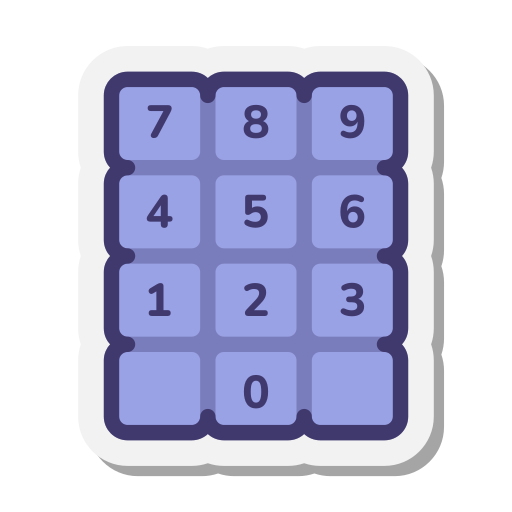

# Practicas II
Proyecto 100% desarrollado en `Android Studio`. 
Hiperbinculos para los documentos:
> **[`Archivos .java`](./app/src/main/java/com/example/a32_cristophersic_vb)**
> * [Main Activity](./app/src/main/java/com/example/a32_cristophersic_vb/MainActivity.java)
> * [Menu](./app/src/main/java/com/example/a32_cristophersic_vb/Menu.java)
> * [Calculadora](./app/src/main/java/com/example/a32_cristophersic_vb/Calc.java)
> * [Reproductor de Audios](./app/src/main/java/com/example/a32_cristophersic_vb/Mult.java)
> * [Calculador de Importe](./app/src/main/java/com/example/a32_cristophersic_vb/Plan.java)

> **[`Archivos .xml`](./app/src/main/res/layout)**
> * [Main Layout](./app/src/main/res/layout/activity_main.xml)
> * [Layout Menu](./app/src/main/res/layout/menu.xml)
> * [Layout Calculadora](./app/src/main/res/layout/calc.xml)
> * [Layout Reproductor de Audio](./app/src/main/res/layout/mult.xml)
> * [Layout Calculo de Importe](./app/src/main/res/layout/plan.xml)
## Recursos de <a href="./app/src/main/res/raw/">Audios</a>
Este sistema (markdown) no permite mostrar graficamente, porlo tanto unicamente se muestra aqui _[[click](./app/src/main/res/raw/)]_
## Recursos de <a href="./app/src/main/res/drawable/">Imagenes</a>
| <!-- --> | <!-- --> | <!-- --> | <!-- --> |
|:-:|:-:|:-:|:-:|
| <!-- --> | Calculos |  | <!-- --> |
| <!-- --> |<!-- -->|<!-- -->| <!-- --> |
| <!-- --> | Lista |  | <!-- --> |
| <!-- --> |<!-- -->|<!-- -->| <!-- --> |
| <!-- --> | Audifonos |  | <!-- --> |
| <!-- --> |<!-- -->|<!-- -->| <!-- --> |
| <!-- --> | Altavoz |  | <!-- --> |
| <!-- --> |<!-- -->|<!-- -->| <!-- --> |
| <!-- --> | Astron |  | <!-- --> |
| <!-- --> | <!-- --> | <!-- --> | <!-- --> |
| <!-- --> | <!-- --> | <!-- --> | <!-- --> |
